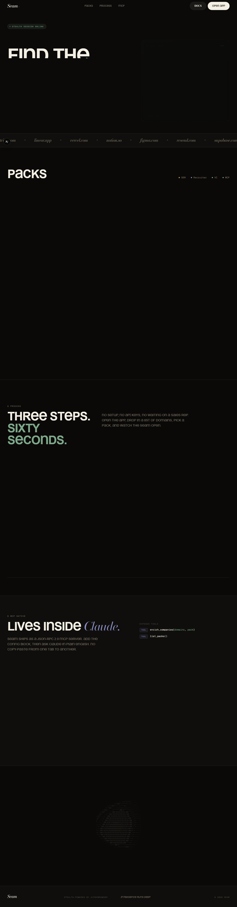
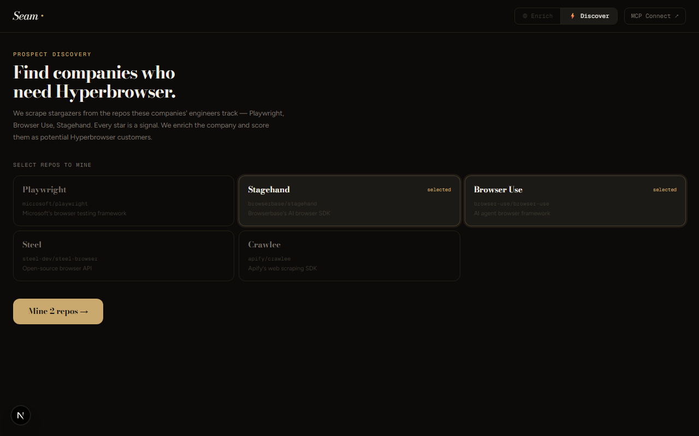
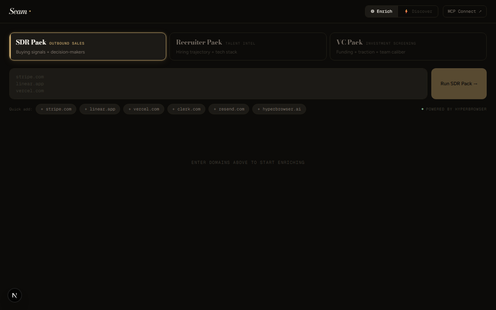
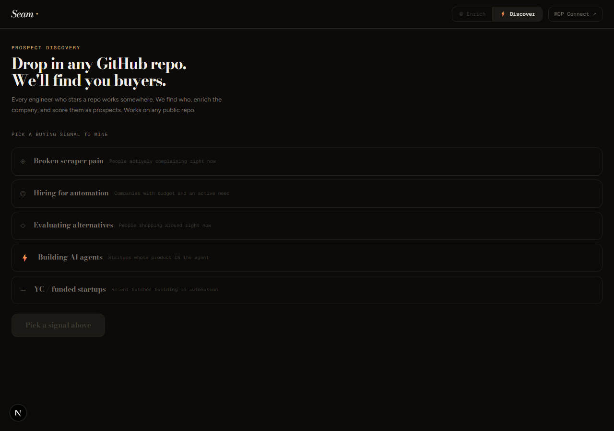

# Seam — B2B Intelligence on Hyperbrowser

> **Intelligence runs deep.**

Seam is a stealth-powered B2B company intelligence tool built as a showcase for [Hyperbrowser](https://hyperbrowser.ai). Paste domains, pick a pack, watch signals stream back in under 60 seconds. No signup. One environment variable.

**Live demo:** https://jstack-omega.vercel.app



---

## What it demonstrates

| Hyperbrowser capability | How Seam uses it |
|------------------------|-----------------|
| **Stealth sessions** | `useStealth: true` bypasses bot detection on every extraction |
| **Multi-URL extraction** | Visits up to 10 pages per domain (homepage, pricing, careers, about, team, press, Crunchbase, LinkedIn) in one session |
| **Structured AI extraction** | `hb.extract.startAndWait()` with a Zod schema → typed, validated output every time |
| **Real-time SSE streaming** | Step events stream from server to client as scraping progresses — no blank loading state |
| **MCP server** | Fully functional JSON-RPC 2.0 MCP server — call `enrich_companies()` directly from Claude Desktop or Cursor |
| **Multi-source discovery** | Parallel extraction across GitHub, YC, HackerNews, ProductHunt, Crunchbase, AngelList, and web |

---

## The four packs

Each pack visits the same company but surfaces different signal shapes:

| Pack | Primary signals | Use case |
|------|-----------------|----------|
| **SDR** | Pricing model, decision-makers, named logos, buying intent | Outbound sales |
| **Recruiter** | Open roles, tech stack from job posts, hiring velocity, eng leaders | Talent sourcing |
| **VC** | Funding stage, named investors, traction proof, founder backgrounds | Investment screening |
| **Growth** | Scale signals, free-tier bottlenecks, upgrade urgency | Free → paid conversion |

---

## Discover mode

Type a description of the companies you're looking for. Seam mines GitHub, YC, HackerNews, ProductHunt, Crunchbase, AngelList, and the open web in parallel and streams back matching companies. Hit **Enrich →** on any result to run a full intelligence pack.



---

## Stack

- **Next.js 16** (App Router, Turbopack)
- **Hyperbrowser SDK** — stealth browser extraction (the only external API)
- **Framer Motion** — live progress animation, split-pane layout
- **Zod** — typed schema validation on extraction output
- **MCP (Model Context Protocol)** — `mcp-remote` stdio bridge for Claude Desktop / Cursor

No Anthropic API key. No other services. One key runs everything.

---

## Screenshots

| Enrich | Discover |
|--------|----------|
|  |  |

---

## Getting started

### 1. Clone & install

```bash
git clone https://github.com/your-org/seam.git
cd seam
npm install
```

### 2. Set environment variables

Create `.env.local`:

```env
HYPERBROWSER_API_KEY=your_key_here
```

Get your API key at [hyperbrowser.ai](https://hyperbrowser.ai).

> **Free tier:** The free Hyperbrowser tier allows one concurrent stealth session. Seam processes domains sequentially so free tier works out of the box.

### 3. Run locally

```bash
npm run dev
```

Open [http://localhost:3000](http://localhost:3000).

### 4. Deploy to Vercel

```bash
vercel deploy
```

Add `HYPERBROWSER_API_KEY` as an environment variable in Vercel project settings.

---

## MCP integration

Seam ships as a fully-functional MCP server. Add this to `~/.config/claude/claude_desktop_config.json`:

```json
{
  "mcpServers": {
    "seam": {
      "command": "npx",
      "args": [
        "mcp-remote",
        "https://jstack-omega.vercel.app/api/mcp"
      ]
    }
  }
}
```

Then ask Claude:

```
> extract stripe.com and linear.app with the SDR pack
> list available packs
```

Exposed tools: `enrich_companies(domains, pack)` · `list_packs()`

---

## How the extraction works

```typescript
// Each domain visits up to 10 URLs in one stealth session
const result = await hb.extract.startAndWait({
  urls: [...baseUrls, ...packSpecificUrls].slice(0, 10),
  prompt: packFocusedPrompt,
  schema: CompanyProfileSchema,         // Zod schema → typed, validated output
  sessionOptions: { useStealth: true }, // Bypass bot detection
});
```

The route fires concurrent SSE step events alongside the blocking scrape, so the UI shows live progress (11 interpolated steps) rather than a blank state.

---

## Forge API (advanced)

`POST /api/forge` generates a self-contained Playwright TypeScript script from an enrichment run's navigation steps and extracted result. Useful for building custom scrapers from Seam's signal patterns.

```bash
curl -X POST https://jstack-omega.vercel.app/api/forge \
  -H 'Content-Type: application/json' \
  -d '{"domain":"stripe.com","pack":"sdr","steps":[...],"finalResult":"..."}'
```

Returns a `.ts` file attachment ready to run with `npx ts-node`.

---

## Project structure

```
app/
  page.tsx                  # Landing page
  app/
    page.tsx                # App — split-pane Enrich + Discover mode
  connect/
    page.tsx                # MCP config + setup guide
  api/
    enrich/
      route.ts              # SSE stream + Hyperbrowser extraction + MCP helper
    discover/
      route.ts              # Multi-source prospect discovery (GitHub, YC, HN, ...)
    mcp/
      route.ts              # JSON-RPC 2.0 MCP server
    forge/
      route.ts              # Playwright script generation from enrichment runs
      codegen.ts            # Script template engine
    _utils.ts               # isValidDomain, sanitizeError, normalizeDomain
    _ratelimit.ts           # Sliding-window per-IP rate limiter
  components/
    SmoothScroll.tsx
proxy.ts                    # Security headers, CSP, same-origin guard, rate limiting
```

---

Built with [Hyperbrowser](https://hyperbrowser.ai) · [Live demo](https://jstack-omega.vercel.app)
